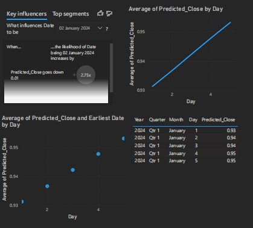

# 💹 MultiCloud-Stock-Forecasting-Analytics
## 📌 Overview
This project leverages various cloud services to build a scalable, explainable, and production-ready stock price prediction system. The architecture integrates machine learning, data processing, storage, and visualization tools to enhance predictive accuracy and interpretability.

## ☁️ Cloud Services
| Service | Description |
|-------------------------------|------------------------------------------------|
| **AWS SageMaker** | Builds, trains, and deploys machine learning models at scale for stock price prediction. |
| **AWS Glue** | Provides ETL (Extract, Transform, Load) capabilities for processing stock data from multiple sources. |
| **Amazon S3** | Stores historical stock data and trained model artifacts securely. |
| **Amazon DynamoDB** | Serves as a NoSQL database to store real-time stock predictions and analytics. |
| **Azure Blob Storage** | Manages unstructured financial data and logs efficiently in a cloud-based storage solution. |
| **Power BI Embedded** | Enables advanced data visualization and reporting for financial insights and stock trends. |

## 🚀 Key Features
- **Multivariate Analysis**: Uses multiple stock features (Open, High, Low, Close, Adjusted Close, Volume) for robust predictions.
- **LSTM-based Approach**: Leverages RNN/LSTM to model sequential dependencies in stock price data.
- **Explainability (SHAP)**: Analyzes feature importance to interpret model decisions.
- **Visualization (TensorBoard)**: Monitors training performance and helps in debugging.
- **Deployment (TF Serving)**: Provides a scalable and production-ready model hosting solution.
- **NLP Integration (FinBERT)**: Enhances predictions by incorporating financial sentiment analysis.

## 📈 Usage
1. **Data Processing**: Stock data is ingested via AWS Glue and stored in Amazon S3.
2. **Model Training**: AWS SageMaker trains LSTM-based models using historical stock data.
3. **Explainability & Monitoring**: SHAP and TensorBoard provide insights into model performance.
4. **Storage & Deployment**: Predictions are stored in Amazon DynamoDB, and the model is deployed using TensorFlow Serving.
5. **Visualization**: Power BI Embedded and Azure Blob Storage facilitate financial reporting and insights.


## 📂 Repository Structure
```
💹 MultiCloud-Stock-Forecasting-Analytics
├── 📂assets
|   ├── powerBI_Visualization.jpg
├── README.md
├── StockMarketForecasting.ipynb
├── Documentation.docx
```

## 👨🏾‍💻 Tech Stack
- **Python**  
- **TensorFlow/Keras**  
- **LSTM**  
- **NumPy & Pandas** 📊  
- **Cloud Services:**  
  - **Amazon Web Services:**  
    - SageMaker  
    - S3  
    - DynamoDB  
    - AWS Glue  
  - **Azure Cloud**
    - Azure Blog Storage (Container)
    - PowerBI Embedded

## 📊 PowerBI Visualization



## 👥Development Team
- `Aakaash M S`
- `Karthik Ram S`

## 🤝 Contributing  
Contributions are welcome! Feel free to fork the repository, work on new features, and submit pull requests.  

## 📝 License  
This project is licensed under the MIT License. 
